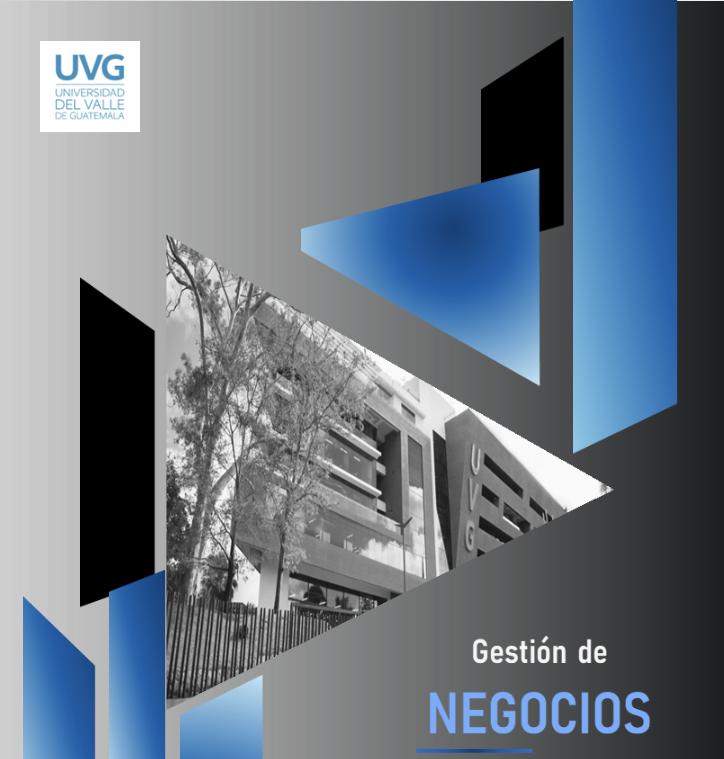

<!-- Improved compatibility of back to top link: See: https://github.com/othneildrew/Best-README-Template/pull/73 -->

<!--
*** Thanks for checking out the Best-README-Template. If you have a suggestion
*** that would make this better, please fork the repo and create a pull request
*** or simply open an issue with the tag "enhancement".
*** Don't forget to give the project a star!
*** Thanks again! Now go create something AMAZING! :D
-->

<!-- PROJECT SHIELDS -->
<!--
*** I'm using markdown "reference style" links for readability.
*** Reference links are enclosed in brackets [ ] instead of parentheses ( ).
*** See the bottom of this document for the declaration of the reference variables
*** for contributors-url, forks-url, etc. This is an optional, concise syntax you may use.
*** https://www.markdownguide.org/basic-syntax/#reference-style-links
-->
[![Contributors][contributors-shield]][contributors-url]
[![Forks][forks-shield]][forks-url]
[![Stargazers][stars-shield]][stars-url]
[![Issues][issues-shield]][issues-url]
<!--[![project_license][license-shield]][license-url] -->
<!-- [![LinkedIn][linkedin-shield]][linkedin-url] -->

<!-- PROJECT LOGO -->
 

  

<h3 align="center">Proyecto Ingenieria de Software</h3>

  

    Universidad del Valle de Guatemala   
    Facultad de Ingeniería   
    Departamento de Ciencias de la Computación   
    CC3090 - Ingeniería de Software 1  
     
  

<!-- TABLE OF CONTENTS -->

  
Tabla de Contenidos

  <ol>
    <li>
      <a href="#Acerca-del-Proyecto">Acerca del Proyecto</a>
    </li>
    <li></li>
    <li><a href="#contactos">Contactos</a></li>
    <li><a href="#Controladores-de-Versiones">Controladores de Versiones</a></li>
  </ol>

<!-- Acerca del Proyecto -->
## Acerca del Proyecto

Este proyecto propone el desarrollo de un sistema integral de gestión de operaciones diseñado específicamente para pequeñas y medianas empresas de los sectores comercial y de servicios, como cafeterías, restaurantes y comercios minoristas. La necesidad de esta solución radica en la falta de integración entre los sistemas de ventas, inventario y administración, lo que genera ineficiencias operativas, incrementa los costos y obstaculiza la toma de decisiones estratégicas. 

(<a href="#readme-top">back to top</a>)

<!-- Colaboradores -->
## Colaboradores
<ul>
  <li>Dulce Ambrosio (231143)</li>
  <li>Daniel Chet (231177)</li>
  <li>Javier Linares (231135)</li>
  <li>Cristian Túnchez (231359)</li>
</ul>

(<a href="#readme-top">back to top</a>)

<!-- CONTACTOS -->
## Contactos

Dulce Ambrosio - amb231140@uvg.edu.gt 
Daniel Chet - che231177@uvg.edu.gt  
Javier Linares - lin231135@uvg.edu.gt  
Cristian Túnchez - tun231359@uvg.edu.gt

(<a href="#readme-top">back to top</a>)

<!-- Controladores de Versiones -->
## Controladores de Versiones

[Documento Word](https://uvggt-my.sharepoint.com/:w:/g/personal/tun231359_uvg_edu_gt/EbokD_-FU_tPoVcGdR8vmdUBwf_j366Uue_zd51q1rkJRw?e=ECLRwl "Enlace a Office365")   
[Repositorio en GitHub](https://github.com/Tunchxz/Proyecto-Ingenieria-de-Software.git "Enlace a GitHub")

(<a href="#readme-top">back to top</a>)

<!-- MARKDOWN LINKS & IMAGES -->
<!-- https://www.markdownguide.org/basic-syntax/#reference-style-links -->
[contributors-shield]: https://img.shields.io/github/contributors/Tunchxz/Proyecto-Ingenieria-de-Software.svg?style=for-the-badge
[contributors-url]: https://github.com/Tunchxz/Proyecto-Ingenieria-de-Software/graphs/contributors
[forks-shield]: https://img.shields.io/github/forks/Tunchxz/Proyecto-Ingenieria-de-Software.svg?style=for-the-badge
[forks-url]: https://github.com/Tunchxz/Proyecto-Ingenieria-de-Software/network/members
[stars-shield]: https://img.shields.io/github/stars/Tunchxz/Proyecto-Ingenieria-de-Software.svg?style=for-the-badge
[stars-url]: https://github.com/Tunchxz/Proyecto-Ingenieria-de-Software/stargazers
[issues-shield]: https://img.shields.io/github/issues/Tunchxz/Proyecto-Ingenieria-de-Software.svg?style=for-the-badge
[issues-url]: https://github.com/Tunchxz/Proyecto-Ingenieria-de-Software/issues
[license-shield]: https://img.shields.io/github/license/Tunchxz/Proyecto-Ingenieria-de-Software.svg?style=for-the-badge
[license-url]: https://github.com/Tunchxz/Proyecto-Ingenieria-de-Software/blob/master/LICENSE.txt
[linkedin-shield]: https://img.shields.io/badge/-LinkedIn-black.svg?style=for-the-badge&logo=linkedin&colorB=555
[linkedin-url]: https://linkedin.com/in/linkedin_username
[product-screenshot]: images/screenshot.png
[Next.js]: https://img.shields.io/badge/next.js-000000?style=for-the-badge&logo=nextdotjs&logoColor=white
[Next-url]: https://nextjs.org/
[React.js]: https://img.shields.io/badge/React-20232A?style=for-the-badge&logo=react&logoColor=61DAFB
[React-url]: https://reactjs.org/
[Vue.js]: https://img.shields.io/badge/Vue.js-35495E?style=for-the-badge&logo=vuedotjs&logoColor=4FC08D
[Vue-url]: https://vuejs.org/
[Angular.io]: https://img.shields.io/badge/Angular-DD0031?style=for-the-badge&logo=angular&logoColor=white
[Angular-url]: https://angular.io/
[Svelte.dev]: https://img.shields.io/badge/Svelte-4A4A55?style=for-the-badge&logo=svelte&logoColor=FF3E00
[Svelte-url]: https://svelte.dev/
[Laravel.com]: https://img.shields.io/badge/Laravel-FF2D20?style=for-the-badge&logo=laravel&logoColor=white
[Laravel-url]: https://laravel.com
[Bootstrap.com]: https://img.shields.io/badge/Bootstrap-563D7C?style=for-the-badge&logo=bootstrap&logoColor=white
[Bootstrap-url]: https://getbootstrap.com
[JQuery.com]: https://img.shields.io/badge/jQuery-0769AD?style=for-the-badge&logo=jquery&logoColor=white
[JQuery-url]: https://jquery.com 
